## Verify the monitoring installation

To confirm that monitoring is properly installed in the Kubernetes cluster, you can take a look at the following screenshots of the running pods and services for each namespace:

### Monitoring Namespace

The following image shows the output for the `monitoring` namespace:

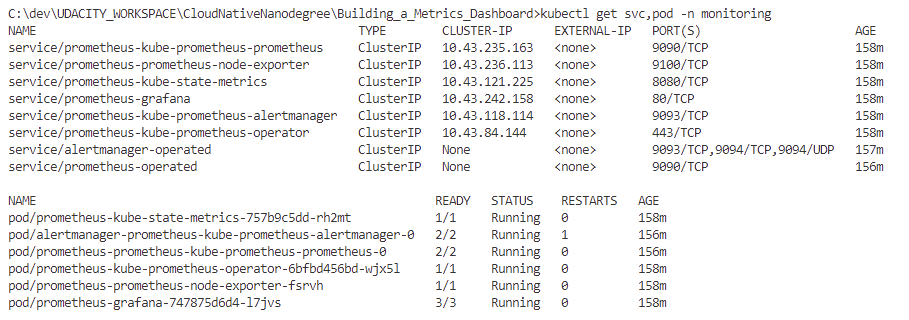

### Observability Namespace

The following image shows the output for the `observability` namespace:

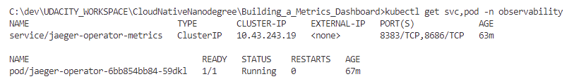

### Default Namespace

The following image shows the output for the `default` namespace:

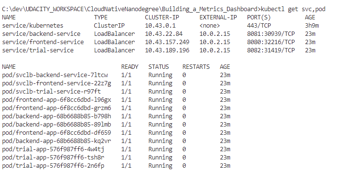

If all components are running and in a healthy state, then the monitoring installation is working properly. 

## Setup the Jaeger and Prometheus source

Expose Grafana to the internet and then setup Prometheus as a data source. The following image shows the home page of Grafana after logging in:
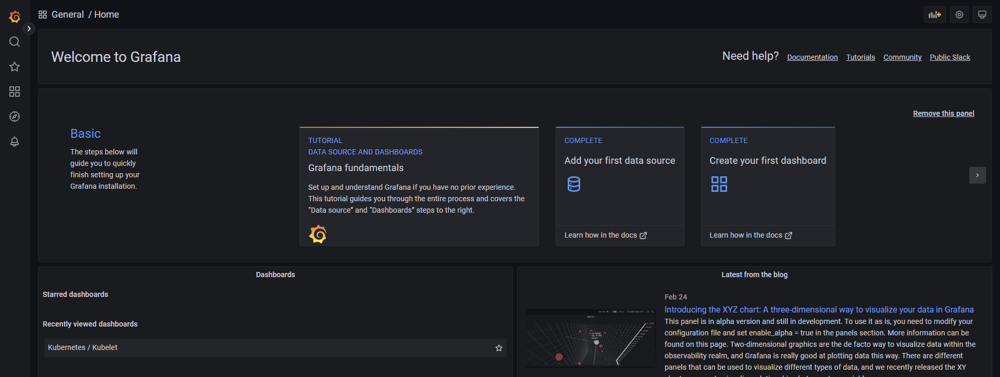

## Create a Basic Dashboard
Create a dashboard in Grafana that shows Prometheus as a source. 
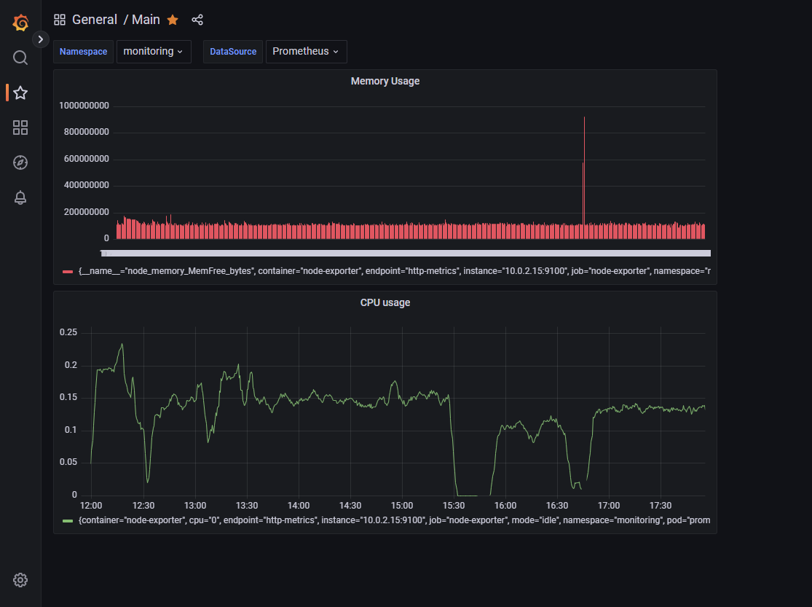

## Describe SLO/SLI
-   **SLOs** specify the level of performance or reliability a service should provide.
-   **SLIs** are metrics that measure the performance and reliability of a service or system.
-   For **request response time SLO**, SLIs might include average, maximum, and minimum response times, and the percentage of requests meeting the response time threshold.
-   For **monthly uptime SLO**, SLIs might include successful requests, failed requests, error codes, and total uptime.

## Creating SLI metrics.
-   **Latency:** Measures time taken for request completion.
-   **Error rate:** Measures percentage of requests resulting in error.
-   **Availability:** Measures percentage of time the service is available.
-   **Throughput:** Measures number of requests per unit of time.
-   **Network capacity:** Measures resource utilization, such as CPU or memory

## Create a Dashboard to measure our SLIs
Below is a dashboard to measure the uptime of the frontend and backend services We will also want to measure to measure 40x and 50x errors. The dashboard shows these values over a 24 hour period.
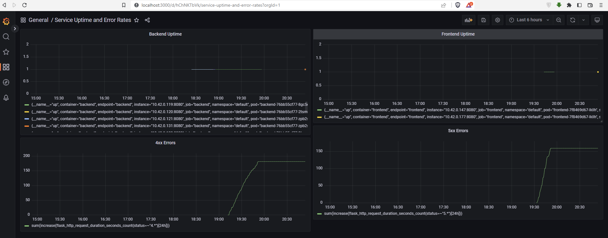

## Tracing our Flask App
A Jaeger span to measure the backend processing time for rendering homepage. 
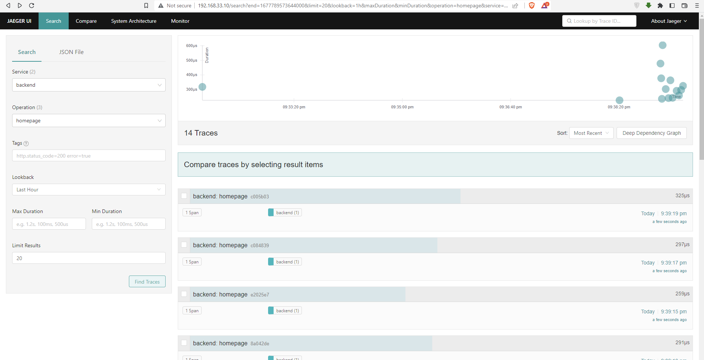

Sample Python code
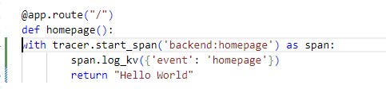

## Jaeger in Dashboard
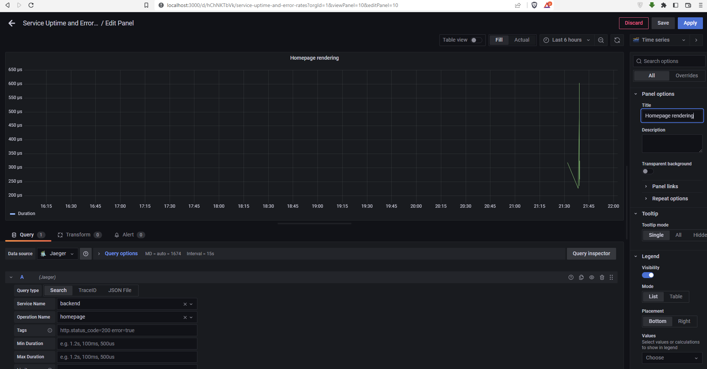

## Report Error
TROUBLE TICKET

Name: Error 500 

Date: March 2, 2023

Subject: Python trial backend throwing 500 errors

Affected Area: Job search functionality

Severity: High

Description:
The Python trial backend is throwing 500 errors when attempting to search for jobs. The issue seems to be with the "get-python-jobs" endpoint, as the tracer is logging errors there. The trace ID for the request is eb47ea79026dfdde.

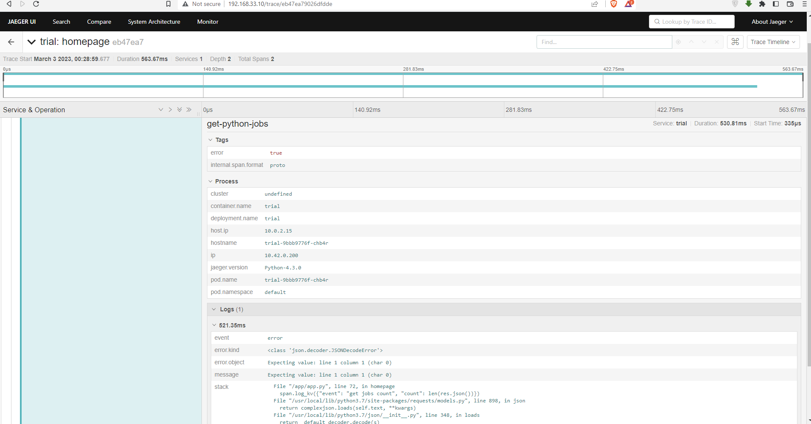

## Creating SLIs and SLOs
To create an SLO guaranteeing that our application has a 99.95% uptime per month, we can use the following SLIs:

-   Availability: The percentage of time the application is available and responsive to user requests. To meet our SLO, we need to ensure that the availability is at least 99.95%.
-   Error Rate: The percentage of requests that result in errors. To meet our SLO, we need to keep the error rate below a certain threshold, such as 0.05%.
-   Latency: The time it takes for the application to respond to user requests. To meet our SLO, we need to ensure that the average latency is within a certain range, such as 500ms to 1s.
-   Resource Utilization: The amount of CPU, memory, and network resources used by the application. To meet our SLO, we need to ensure that the resource utilization stays within acceptable limits, such as 80% of CPU usage, 90% of memory usage, and 90% of network usage.

## Building KPIs for our plan
Based on the SLIs and SLOs that we defined earlier, we can create the following KPIs to measure our metrics:

-   Availability KPI: Measures uptime percentage with a line chart, goal line at 99.95%.
-   Error Rate KPI: Measures error percentage with a stacked bar chart, goal line at 0.05%.
-   Latency KPI: Measures average response time with a line chart, goal range of 500ms to 1s.

## Final Dashboard
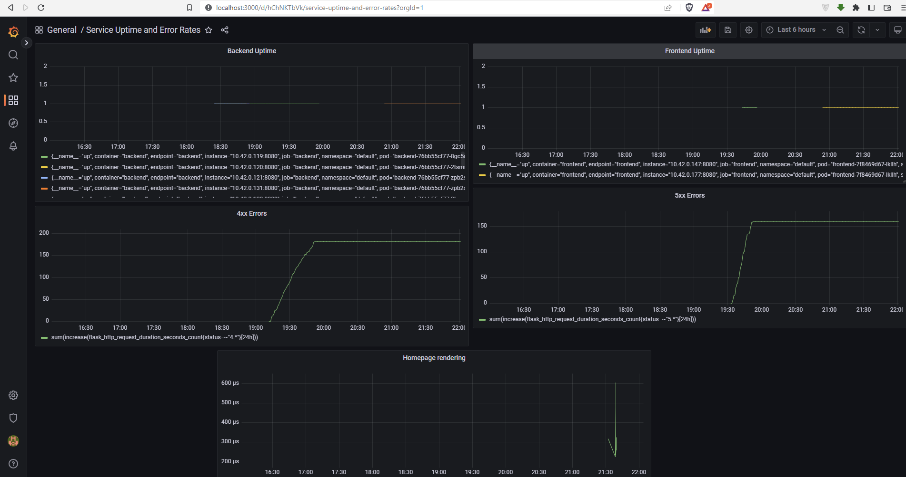

1.  CPU Usage: Measures the percentage of CPU used by the application over time.
2.  Memory Usage: Measures the amount of memory used by the application over time.
3.  4xx Errors: Measures the number of client errors (HTTP 4xx status codes) generated by the application over time.
4.  5xx Errors: Measures the number of server errors (HTTP 5xx status codes) generated by the application over time.
5.  Homepage Rendering: Measures the time it takes for the application to render the homepage for users.

